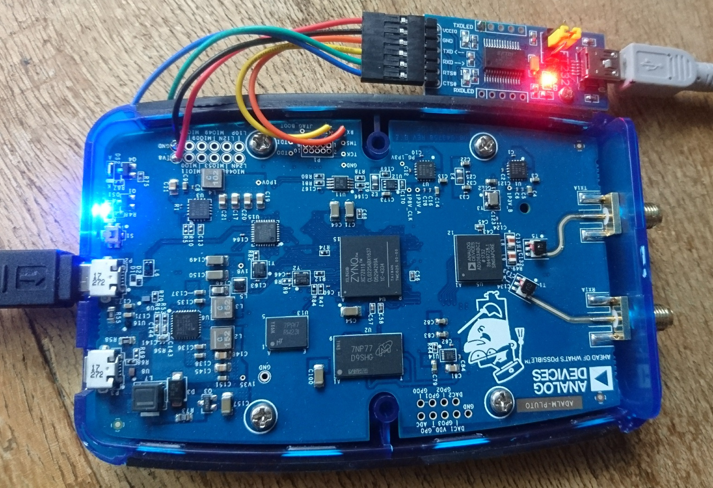

# PlutoSDR
BR2_EXTERNAL framework for Analog Device's PlutoSDR Zynq

This repository provides buildroot based support for ADALM-pluto board (based on
[Analog Device's plutosdr-fw](https://github.com/analogdevicesinc/plutosdr-fw)).

At the moment, this repository provides only support for rootfs and linux (the bootloader
part still remains to be added).

It uses the BR2_EXTERNAL mechanism to add this support to buildroot.

This support has been tested with the latest stable release of buildroot (2018.11.1).

How-to use it
=============

Download the latest tested buildroot tarball:
```bash
wget https://buildroot.org/downloads/buildroot-2018.11.1.tar.gz
```

Adding support for the PlutoSDR requires sourcing the **sourceme.ggm** file to add the **BR2_EXTERNAL** 
variable definition (alternatively, one might want to add <code>export
BR2_EXTERNAL=/somewhere/PlutoSDR</code> to the *.bashrc* initialization file).

In the buildroot directory  
```bash
make zynq_pluto_defconfig
```
will configure buildroot for minimal PlutoSDR support. More ambitious, after git cloning the 
latest release of buildroot,
```bash
make zynq_pluto_gnuradio_defconfig
```
will configure buildroot for PlutoSDR support in addition to GNURadio. The default configuration is
to not support Python, yielding a 13.4 MB image. Activating Python requires going to <code>Target Packages --> Interpreter
languages --> python</code> and then <code>Miscellaneous --> gnuradio --> python support</code>. We also 
activate gr-zeromq support to stream I/Q coefficients from the PlutoSDR to the PC. Do not attempt adding Python
support after compiling an image without Python support: the gnuradio packages would not be compiled properly.
Start from scratch from a clean output directory (<code>rm -rf output</code>). For the resulting image to be
smaller than 32 MB, we remove <code>wpa_supplicant</code> and associated 802.11 packages as well as <code>avahi</code>.

Overall, <code>make menuconfig</code> allows for configuring
additional settings of the buildroot environment, especially Target Packages, <code>make</code> builds
the images to be found at the end of the compilation in <code>output/images</code>.

The <code>output/images/pluto.frm</code> file is then copied to the mass storage mounted from the PlutoSDR (in
most cases <code>/dev/sdb1</code>)
and then written after ejecting the associated mass storage root (in this example <code>sudo eject /dev/sdb</code>) as 
explained at [Analog Device's PlutoSDR firmware information](https://wiki.analog.com/university/tools/pluto/users/firmware)

In case of failure, DFU programming provides a backup solution. 



Doing so does not necessarily require the FTDI USB to R232 converter, although this peripheral will provide a prompt to check what
is happening on the PlutoSDR. Switching to DFU mode is achieved by mounting the first mass storage partition (let's say /dev/sdb1),
modifying <code>config.txt</code> to set <code>dfu = 1</code>, and saving the change + rebooting the board with <code>sudo eject 
/dev/sdb</code>. Once the board is in DFU mode, the DFU image is flashed with <code>dfu-util  -D /tmp/pluto.dfu -a firmware.dfu</code>.

GNU Radio on the PlutoSDR
=========================

Listening to an FM station demodulated by the WBFM block running on the Zynq PS requires activating the
second CPU core, extending the AD9363 carrier frequency band to those of the AD9364, and compiling fftw with
speed optimization. With such considerations, the following [processing block](doc/top_block_for_pluto.py). The
following [processing block](doc/top_block_for_PC.py) is run on the PC to fetch data through a 0MQ socket and
play sound on the PC speaker.


Activating hard-floating point processing is mandatory to achieve continuous FM demodulated sound stream: indeed, lacking the
[~40% processing gain](https://blog.paranoidpenguin.net/2017/09/hard-float-vs-soft-float-with-slackware-arm-on-the-rpi-3/) would 
result in discontinuous sound output due to insufficient computational power to run the WBFM block on the
minimum 200-kS/s input stream.

Custom bitstream on the PL
==========================

Customizing the PL bitstream meets some requirement for full control of the PlutoSDR features: in this example, an ALSA-compatible
audio output is added to make the PlutoSDR a fully autonomous FM-broadcast radio receiver.
